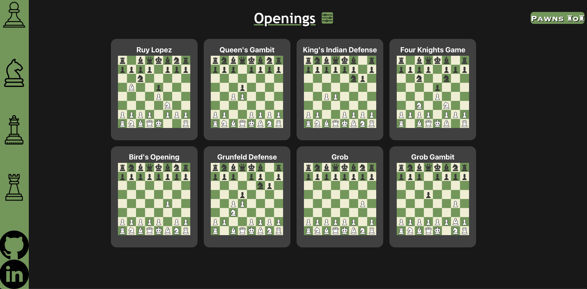
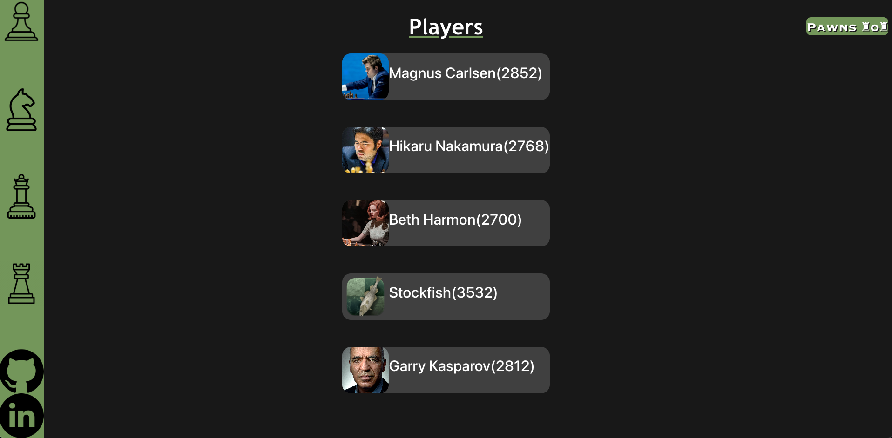

# ♟️ Pawns 101 ♟️

## Date 2/17/23

## ♟️ By: Noah Vaughn ♟️

[Trello](https://trello.com/b/bga8bsP1/pawns-101)
|
[LinkedIn](https://www.linkedin.com/in/noahvaughn/)
|
[Github](https://github.com/noahdvaughn)
|

---

### **_Description_**

Week 6 General Assembly Software Immersive project. A fullstack application that uses CRUD operations for users to interact with chess openings and top chess players. Built on React, Express, Node and MongoDB

---

### **_Technologies Used_**

- React
- MongoDB
- Express
- JavaScript
- Node

---

### **_Screenshots_**

## Opening Page

## Players Page

### **_Future Updates_**

-[ ] Add calls to Lichess API for position evaluation.

### **_Credits_**

Game stream widget from Lichess.org
